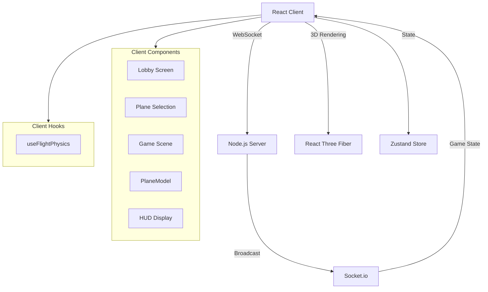
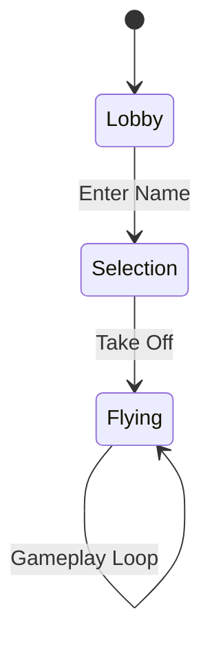

# System Architecture

## Overview

Otter Planes IO is a browser-based multiplayer flight simulator built with React, ThreeJS, and Socket.io. Features semi-realistic aerodynamics, multiple aircraft types, and real-time multiplayer.

## Component Diagram



## Game Flow



## Aerodynamic Physics Model

### Force Equations

| Force | Formula | Description |
|-------|---------|-------------|
| **Lift** | `L = 0.5 × ρ × V² × S × Cl(α)` | Perpendicular to wings |
| **Drag** | `D = 0.5 × ρ × V² × S × (Cd0 + Cdi)` | Opposes velocity |
| **Induced Drag** | `Cdi = Cl² / (π × AR × e)` | Drag from lift generation |
| **Thrust** | `T = throttle × maxThrust` | Forward force from engine |
| **Gravity** | `G = mass × 9.81` | Downward force |

### Variables

- `ρ` = Air density (1.225 kg/m³)
- `V` = Airspeed (m/s)
- `S` = Wing area (m²)
- `Cl(α)` = Lift coefficient (function of angle of attack)
- `Cd0` = Parasitic drag coefficient
- `AR` = Aspect ratio (wingspan² / wing area)
- `e` = Oswald efficiency (~0.8)
- `α` = Angle of attack (radians)

### Stall Model (Forgiving)

```
if (α < stallAngle):
    Cl = 2π × α  (capped at ClMax)
else:
    Cl = ClMax × 0.3 to 0.7 (gradual recovery)
```

Stall behavior includes visual buffeting but smooth nose-drop recovery.

### Load Factor (G-Force)

```
G = 1 / cos(bankAngle)
```

Used for HUD display and physics calculations during turns.

## Aircraft Configurations

| Plane | Wing Area | Mass | Max Thrust | Roll Rate | Stall AoA |
|-------|-----------|------|------------|-----------|-----------|
| WW2 (P-51) | 21.6 m² | 4175 kg | 12 kN | 2.5 rad/s | 15° |
| Jet (F-22) | 78 m² | 19700 kg | 160 kN | 3.5 rad/s | 20° |
| Biplane (Fokker) | 18.7 m² | 586 kg | 2.5 kN | 4.0 rad/s | 12° |

## Key Components

### PlaneModel.tsx
Modular plane geometry supporting 3 variants with animated control surfaces and configurable colors.

### useFlightPhysics.ts
Core physics engine implementing aerodynamic equations with:
- Angle of attack calculation
- Lift/drag coefficient curves
- Stall detection and recovery
- Load factor computation
- Per-plane configuration

### PlaneSelection.tsx
3D plane preview with stats display and variant navigation.

### PlaneBuilder.tsx
Ultimate aircraft customization system with:
- **10 Part Categories**: 60+ parts affecting Speed, Agility, Durability stats
- **Real-time Stats**: Live performance bars calculated from equipped parts
- **Tab Navigation**: Structure, Aerodynamics, Powerplant, Details, Colors, Saved
- **Save/Load**: localStorage persistence for custom designs
- **3D Preview**: Live rendering with React Three Fiber, OrbitControls, Environment lighting
- **Color System**: 16 presets + custom color pickers for Primary, Secondary, Accent, Glow
- **Stats Calculator**: Aggregates part modifiers to compute final performance values

**Part Stats System:**
Each part has modifiers for Speed, Agility, Durability. Base stats (50/50/50) + part modifiers = final stats (clamped 0-100).

**Saved Planes Format:**
```typescript
{
  id: string,
  config: PlaneConfig,
  savedAt: number
}
```

### HUD.tsx
Flight instruments showing:
- Throttle gauge (vertical bar)
- Speed (knots), Altitude (feet), Heading (degrees)
- G-force meter
- Angle of attack indicator
- Stall warning

## Network Protocol

### Client → Server
`playerUpdate`: `{ position: [x,y,z], rotation: [x,y,z], velocity: [x,y,z] }`

### Server → Client
`gameState`: `[{ id, position, rotation, velocity, timestamp }, ...]`

## State Management (Zustand)

- `gamePhase`: 'lobby' | 'selection' | 'flying'
- `selectedPlane`: 'ww2' | 'jet' | 'biplane' | 'boeing747' | 'stealth' | 'interceptor' | 'sopwith' | 'spad' | 'otter' | 'tungtung'
- `flightData`: { speed, altitude, heading, throttle, AoA, gForce, isStalling }
- `controlInputs`: { pitch, roll, yaw, throttle }
- `otherPlayers`: Array of multiplayer player data
- `planePosition`: THREE.Vector3 for minimap tracking

## KeybindManager System

Unified input handling at `systems/KeybindManager.ts`:

```
KeybindAction types:
- Flight: pitch_up, pitch_down, roll_left, roll_right, yaw_left, yaw_right, throttle_up, throttle_down
- UI: pause, minimap_toggle, minimap_size
- Camera: camera_next, camera_prev

React Hooks:
- useKeybindAction(action, callback) - Subscribe to key press events
- useKeybindDisplay(action) - Get display name for a keybind
- useKeybind(action) - Check if key is currently pressed
```

## World Structure

```
components/world/
├── WorldManager.tsx     # Central hub for all world components
├── Runway.tsx          # Main airport runway
├── ControlTower.tsx    # Air traffic control
├── Terminal.tsx        # Passenger terminal
├── Hangars.tsx         # Aircraft hangars (3)
├── FuelStation.tsx     # Refueling facility
├── WeatherStation.tsx  # Observatory dome
├── Lighthouse.tsx      # Rotating beacon (animated)
├── WindFarm.tsx        # 7 wind turbines (animated)
├── RadioTowers.tsx     # Communication towers (blinking lights)
├── Helipad.tsx         # Helicopter pad with parked heli
├── WaterTower.tsx      # "OTTER CITY" water tower
├── Roads.tsx           # Road network connecting landmarks
├── Mountain.tsx        # MT. DORP mountain with sign
└── MountainBorder.tsx  # Ring of mountains around world edge
```

## Minimap System

`components/Minimap.tsx` features:
- Position: Top-right corner
- 3 sizes: Small (150px), Medium (250px), Large (400px)
- Fullscreen mode with legend
- Player arrow with heading rotation
- POI markers by type (airport, landmark, infrastructure, nature)
- Road network visualization
- Dynamic keybind display from KeybindManager

Controls:
- `M`: Toggle fullscreen map
- `U`: Cycle minimap size

## Location Registry

`config/worldLocations.ts` provides:
- `WORLD_LOCATIONS[]` - All POI coordinates with metadata
- `ROAD_NETWORK[]` - Road segment definitions
- `MAP_BOUNDS` - World size constants
- Utility functions: `getLocationById()`, `getNearestLocation()`, `getDistanceToLocation()`

## Plane Builder Architecture

### Component Structure
```
PlaneBuilder.tsx
├── PlanePreview3D (3D rendering)
│   ├── Fuselage variants (6 types)
│   ├── Wing variants (6 types)
│   ├── Tail variants (6 types)
│   ├── Engine variants (6 types)
│   ├── Nose variants (6 types)
│   ├── Wingtip variants (6 types)
│   ├── Landing gear variants (6 types)
│   ├── Cockpit variants (6 types)
│   ├── Decal overlays (7 types)
│   └── Accessory attachments (6 types)
├── StatBar (Performance display)
├── PartSelector (Part selection grid)
└── Tab Navigation (6 categories)
```

### Stats Calculation
```typescript
Base Stats: { speed: 50, agility: 50, durability: 50 }
For each equipped part:
  speed += part.speedModifier
  agility += part.agilityModifier
  durability += part.durabilityModifier
Final Stats: Clamp each to [0, 100]
```

### Data Flow
1. User selects part → `updateConfig()` updates state
2. `useMemo` recalculates stats from config
3. `PlanePreview3D` re-renders with new geometry
4. `StatBar` components update with new values
5. Save action → localStorage persistence
